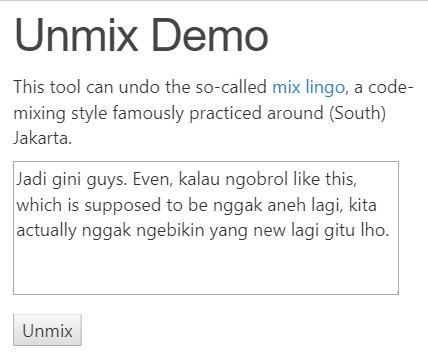

# Unmix

Unmix is a tool can undo,  to a certain extent, the so-called South Jakarta style of code-mixing (for more details, read the following article from The Jakarta Post: [Mix lingo 'literally' a thing for South Jakartans](http://www.thejakartapost.com/news/2018/09/05/mix-lingo-literally-a-thing-for-south-jakartans.html)).

To see how it works, please check its [online demo](https://ariya.io/demo/unmix):

Note that Unmix does not implement a full-fledged NLU (natural language understanding). Therefore, it may not identify all possible revertible code-mixing forms. It also has a limited set of vocabulary.  If Unmix does not behave as expected, please file a bug or even better submit a pull request!

This module is created and maintained by [@AriyaHidayat](https://twitter.com/AriyaHidayat).
